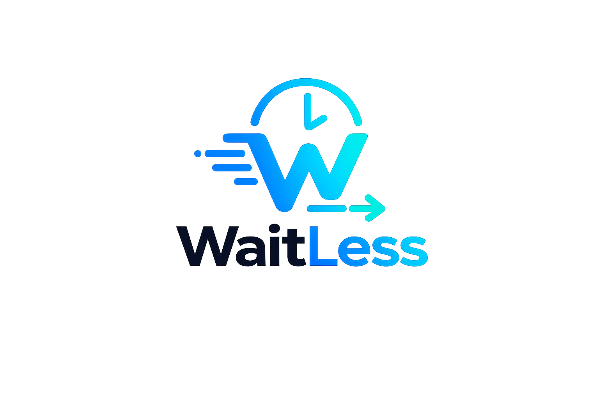

<div align="center">
  

  # WaitLess

  **Smart Digital Queue Management System**

  [](https://www.python.org/)
  [](https://fastapi.tiangolo.com/)
  [](https://nextjs.org/)
  [](https://www.mongodb.com/)
  [](https://render.com/)
  [](https://tailwindcss.com/)
</div>

---

## Overview

**WaitLess** is a modern web application designed to eliminate physical waiting lines at banks, hospitals, government offices, salons, and commercial spaces through seamless QR code-based digital queuing.

### The Problem

Standing in long queues wastes valuable time and causes frustration. Visitors are traditionally forced to remain seated in crowded lobbies just to preserve their position in line.

### The Solution

With **WaitLess**, visitors simply:

- Scan a location-specific QR code on their smartphone
- Fill out an intake form (if required)
- Secure their spot in the digital queue

Visitors are free to utilize their waiting time productively outside the lobby while receiving live position updates and timely alerts on their devices.

---

## How It Works

1. **Administrator Onboarding**: Service providers sign up and register their location on the WaitLess platform.
2. **Form Configuration**: Administrators create customized intake forms tailored to their service requirements.
3. **QR Code Generation**: The platform generates a unique digital queue access link and QR code.
4. **Digital Check-In**: Customers scan the QR code to join the queue remotely without standing in line.

---

## Key Features

### Administrator Tools
- **Real-Time Analytics & Command Center**: Monitor metrics including total, completed, skipped, and cancelled appointments within selected timeframes.
- **Team Management**: Add coordinators and staff members to streamline multi-counter operations.
- **Custom Form Builder**: Design dynamic forms to capture client information efficiently.
- **Flexible Scheduling Controls**: Configure appointment durations and token expiry thresholds.
- **Live Queue Management**: Monitor and control active queues with one-click actions (Call Next, Skip, Cancel).

### Client Experience
- **Personal Dashboard**: Track all active queue details from a clean mobile interface.
- **Real-Time Queue Position**: Monitor live position changes in real time.
- **Estimated Waiting Time**: View dynamic ETA calculations.
- **Emergency Notifications**: Send urgent notifications or updates to administrators when necessary.
- **Custom Reminders**: Set automated alerts before an appointment turn arrives.
- **Spot Exchange**: Request queue position swaps with other waiting clients.
- **Instant Cancellation**: Cancel appointments anytime with a single click.

---

<!-- ## Setup Instructions

1. **Install Dependencies**
   ```bash
   npm install
   ```

2. **Run Development Server**
   ```bash
   npm run dev
   ```

3. Open [http://localhost:3000](http://localhost:3000) in your browser.

---

## Contribution Guidelines

### Forking and Repository Management

1. **Fork & Clone**
   ```bash
   git clone https://github.com/YOUR_USERNAME/waitless-next.git
   cd waitless
   git remote add upstream https://github.com/ORIGINAL_OWNER/waitless-next.git
   ```

2. **Syncing Main Branch**
   ```bash
   git checkout main
   git pull upstream main
   git push origin main
   ```

3. **Branch Naming Pattern**
   Format: `[initials]/[label]/[work]` (e.g., `yv/feat/admin-dashboard`)
   ```bash
   git checkout -b yv/feat/admin-dashboard
   ```

4. **Committing and Pushing Changes**
   ```bash
   git add .
   git commit -m "feat: implement real-time analytics dashboard"
   git fetch upstream
   git merge upstream/main
   git push origin yv/feat/admin-dashboard
   ``` -->
